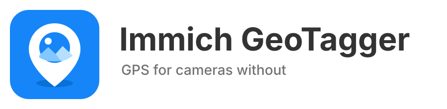

  

  <strong>Give cameras without GPS a place on your Immich map.</strong>

  <a href="https://github.com/andreas-aichele/immich-geotagger/releases/latest"><strong>⬇ Download latest release</strong></a>
  &nbsp;·&nbsp;
  <a href="https://github.com/andreas-aichele/immich-geotagger/issues">Report an issue</a>

  Open source · Built for self-hosted Immich · Location history stays on your phone

---

**Give photos from cameras without GPS the location they were actually taken at.**

Immich GeoTagger is a small companion app for **Immich**. It was created for people who take photos with a DSLR, mirrorless camera, or any other camera without reliable GPS and still want their photos to appear at the correct places on the Immich map.

Instead of manually assigning locations to photos afterwards, you simply take your phone with you. GeoTagger records where you were and later matches that information with the capture time of your photos.

## Get Immich GeoTagger

Ready to try it? Download the latest version from **GitHub Releases**.

### [⬇ Download Immich GeoTagger](https://github.com/andreas-aichele/immich-geotagger/releases/latest)

**Android:** download the APK and install it on your phone. The first-start guide walks you through location access and connecting your Immich server.

> **Note for iPhone users:** iOS builds currently require manual signing and are not yet available as a normal App Store installation.

## Why does this app exist?

Many dedicated cameras create excellent photos but do not save a GPS location. After importing those photos into Immich, the timeline is complete, but the map is not.

Immich GeoTagger fills that gap.

The idea is simple:

**Your camera records the photo. Your phone records where you are. GeoTagger brings both together.**

You do not need to connect your camera to your phone, install anything on the camera, or change the way you import photos.

## How it works

The workflow is intentionally simple — GeoTagger stays out of the way of your normal photography and Immich import process.

1. **Start tracking before taking photos.**  
   GeoTagger records your location in the background while your phone stays in your pocket.

2. **Take photos as usual.**  
   Use your DSLR or mirrorless camera exactly as you normally would.

3. **Import the photos into Immich.**  
   Your normal photo workflow does not change.

4. **Let GeoTagger match the photos.**  
   The app compares the capture time of photos without a location with your recorded location history.

5. **The location is added to Immich.**  
   Matching photos receive their calculated position and can then appear correctly on the Immich map.

### What if a photo was taken between two recorded locations?

Your phone does not need to record GPS every second.

For example, if GeoTagger knows where you were at **10:00** and again at **10:10**, a photo taken at **10:05** can be placed between those two positions.

GeoTagger only does this when it has enough information for a safe match. It does not guess a position outside the recorded route, and you can configure how large the gap between location measurements may be.

## Your existing locations are safe

GeoTagger is designed to complement the location data already in your photo library.

**Photos that already have a GPS location are left untouched.**

Only photos without location information are considered for matching.

## Privacy

Your location history is stored **on your phone**. You can choose how long GeoTagger should keep it before deleting old points automatically.

GeoTagger does not require its own cloud service. When a photo is matched, only the calculated location is sent to **your own Immich server**.

## What you need

- an Android phone or iPhone
- your own Immich installation
- an Immich API key
- a camera whose clock is set correctly

During the first start, GeoTagger guides you through the required location permission and Immich connection.

## Languages

The app currently supports:

**English · Deutsch · Français · Español · Nederlands**

GeoTagger automatically uses the language configured on your device. Unsupported languages fall back to English.

## Current status

Immich GeoTagger is a young open-source project and is still being actively developed.

The core workflow is already implemented: recording a location timeline, safely matching photos by capture time, preserving existing GPS data, and applying new locations to Immich.

If you find a problem or have an idea for an improvement, feel free to open an issue.

## Development

For local setup and the shared GitHub/local workflow, see [Platform setup](docs/PLATFORM_SETUP.md).

## License

Immich GeoTagger is open source and available under the **MIT License**.
