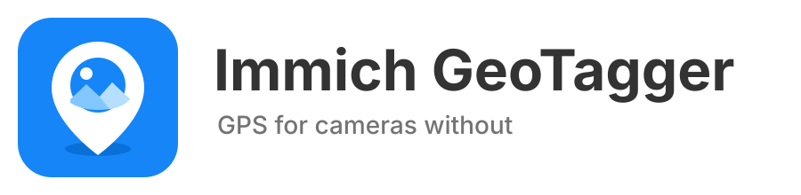

  

  <strong>Bring accurate location data to photos and videos from cameras without GPS.</strong>

  
  
  
  
  
  

  <a href="https://github.com/andreas-aichele/immich-geotagger/releases/latest"><strong>Download</strong></a>
  &nbsp;·&nbsp;
  <a href="#installation">Install</a>
  &nbsp;·&nbsp;
  <a href="#how-it-works">How it works</a>
  &nbsp;·&nbsp;
  <a href="https://github.com/andreas-aichele/immich-geotagger/issues">Issues</a>

  Open source · Built for self-hosted Immich · No Google Play Services required · Your location history stays on your phone

---

## Your camera takes the photo. Your phone remembers where.

Many DSLR, mirrorless, compact, and vintage digital cameras take excellent photos but have no GPS — or GPS that is too slow or unreliable to be useful.

**Immich GeoTagger fills that gap.**

GeoTagger is built as a companion for **[Immich](https://immich.app/)** — an outstanding open-source, self-hosted photo and video management project and a fantastic home for your personal photo library. GeoTagger focuses on one small missing piece: bringing reliable location data to photos from cameras that do not provide it themselves.

Keep your phone with you while shooting. GeoTagger records your route in the background, matches it against the capture time of media imported into Immich, and lets you review the proposed locations before anything is changed.

No camera pairing. No proprietary cloud. No manual pin-dropping for every photo.

## Highlights

| Feature | What it does |
| --- | --- |
| **📍 Automatic geotagging** | Match photos and videos against your recorded GPS timeline using their capture time. |
| **🗺️ Smart interpolation** | Calculate positions between recorded GPS points while rejecting unsafe or implausible matches. |
| **✅ Review before applying** | Inspect thumbnails, timestamps, map positions, and matching quality before writing anything to Immich. |
| **🛡️ Existing GPS stays untouched** | Media that already contains a location is skipped automatically. |
| **🔋 Adaptive background tracking** | Choose between battery-friendly **Balanced** tracking and more detailed **Precise** tracking. |
| **📌 Manual location points** | Save your current position whenever you want an additional reliable GPS anchor. |
| **📤 GPX export** | Save or share your recorded location history as a GPX file. |
| **🔐 Privacy-first** | Location history remains local on your phone; GeoTagger has no separate backend or cloud service. |
| **🌐 Self-hosted by design** | Connect directly to your own Immich server using an API key. |
| **📵 Google-free Android support** | Background tracking uses Android's AOSP LocationManager and does not require Google Play Services. |

## Installation

### Android

The recommended way to install GeoTagger is with **[Obtainium](https://github.com/ImranR98/Obtainium)**. Obtainium installs and updates Android apps directly from their original release sources, making it a great fit for GeoTagger.

**[Get Obtainium →](https://github.com/ImranR98/Obtainium)**

1. Install [Obtainium](https://github.com/ImranR98/Obtainium).
2. Add this repository:
   `https://github.com/andreas-aichele/immich-geotagger`
3. Install the latest APK offered by Obtainium.

You can also install the APK manually from **[GitHub Releases](https://github.com/andreas-aichele/immich-geotagger/releases/latest)**.

### iOS

Unsigned iOS builds are published with GitHub releases. They currently require manual signing or sideloading and are not distributed through the App Store.

## How it works

GeoTagger is designed to fit into your existing photography workflow.

### 1. Start tracking

Start GeoTagger before taking photos. Your phone records your location in the background while it stays in your pocket or bag.

### 2. Take photos normally

Use your DSLR, mirrorless camera, compact camera, or any other camera exactly as usual. The camera does not need to communicate with your phone.

### 3. Import into Immich

Import your photos and videos through your normal Immich workflow.

> [!IMPORTANT]
> Keep the **camera clock and time zone aligned with your phone**. GeoTagger matches media using its capture timestamp. Images without explicit timezone information are highlighted during synchronization so ambiguous timestamps can be reviewed.

### 4. Let GeoTagger find the matches

GeoTagger compares media without an existing GPS location against your recorded route.

Its matching logic uses nearby GPS points, interpolation, movement, stationary periods, and track consistency to avoid assigning obviously implausible locations.

### 5. Review everything

Before making changes, GeoTagger shows the proposed matches with:

- Immich thumbnails
- capture timestamps
- surrounding GPS timestamps
- an interactive OpenStreetMap map
- the calculated location
- matching diagnostics for media that could not be safely placed

You decide which matches should be applied.

### 6. Apply to Immich

GeoTagger writes latitude and longitude only to the selected media on your own Immich server.

## Smart matching without constant GPS recording

Your phone does not need to save a GPS point every second.

If GeoTagger knows where you were at **10:00** and again at **10:10**, a photo taken at **10:05** can usually be placed between those positions.

The matching engine is deliberately conservative:

- normal movement is interpolated only across short, consistent GPS gaps
- stationary periods can safely span longer gaps
- a nearby GPS point can be used when interpolation is not possible
- isolated GPS spikes are ignored for matching
- sustained high-speed travel is not mistaken for a single bad GPS jump
- media is left unmatched when there is not enough reliable information

The goal is not to assign a location at any cost — it is to assign one only when the recorded track provides a useful answer.

## Your existing locations are safe

**GeoTagger does not overwrite media that already has GPS coordinates.**

Only photos and videos without location information are considered for matching.

Every synchronization starts with a preview, and only the media you approve is updated.

## Privacy by design

GeoTagger does not need its own cloud service.

- Your GPS history is stored **locally on your phone**.
- You decide how long recorded locations are retained.
- The update history stores only Immich asset IDs and update timestamps locally.
- Current names, thumbnails, and metadata are loaded from your Immich server when needed.
- Deleted or trashed Immich media is automatically omitted from the history.
- Only approved calculated locations are written back to **your own Immich server**.
- Android location tracking does **not** require Google Play Services.

Map previews use **OpenStreetMap** data through the open-source Flutter mapping stack.

## Tracking modes

### Balanced

Designed for everyday and all-day use. GeoTagger adapts location recording to movement while reducing unnecessary GPS activity.

### Precise

Designed for dedicated photo trips or situations where a denser location history is more important than battery consumption.

You can also save a **manual location point** at any time when you want to create an additional known position in the track.

## GPX export

Your recorded GPS history is not locked into the app.

From the settings, you can:

- save the recorded track as a GPX file
- share the GPX file with another app or device
- use the export as a backup or with compatible mapping and photography tools

## What you need

- an Android phone, or an iPhone with a suitable sideloading/signing workflow
- a self-hosted **[Immich](https://immich.app/)** installation
- an Immich API key
- a camera with a reasonably accurate clock

The first-start guide walks you through location permissions and the Immich connection.

## Languages

Immich GeoTagger currently supports:

**English · Deutsch · Français · Español · Nederlands**

The app follows your device language and falls back to English when the configured language is not available.

## Open source

Immich GeoTagger is built in **Flutter** and released under the **MIT License**.

Contributions, bug reports, and feature ideas are welcome:

- [Report an issue](https://github.com/andreas-aichele/immich-geotagger/issues)
- [View releases](https://github.com/andreas-aichele/immich-geotagger/releases)
- [Platform setup for development](docs/PLATFORM_SETUP.md)

## License

Immich GeoTagger is available under the [MIT License](LICENSE).
